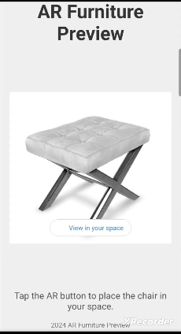

# AR-Furniture-Preview
 
This project demonstrates the use of model-viewer to showcase 3D models in augmented reality (AR). Users can interact with a 3D model of furniture and view it in their real-world environment using an AR-enabled device.

---

### Webpage

---

### View in your space

